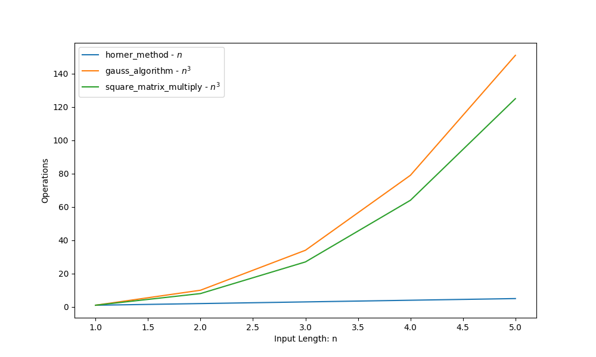

**Algebra Algorithm Complexity Analisys ( worst case )**
========================================================

README writed by: [MARKPLATE](https://github.com/cecinuga/markplate)

**Horner Method - $\ O(n)$**
----------------------------

**Square Matrix Multiply - $\ O(n^3)$**
---------------------------------------

**Gauss Algorithm - $\ O(n^3)$**
--------------------------------

Complexity Analysis
  

  
#### All sorting algorithms are in the Cormen notation

