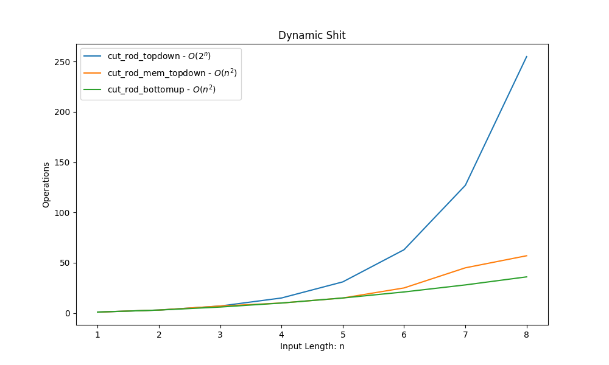

**DynamicProgramming Algorithm Complexity Analisys ( worst case )**
===================================================================

README writed by: [MARKPLATE](https://github.com/cecinuga/markplate)

**Cut Rod Topdown - $\ O(2^n)$**
--------------------------------

**Cut Rod Mem Topdown - $\ O(n^2)$**
------------------------------------

**Cut Rod Bottomup - $\ O(n^2)$**
---------------------------------

Complexity Analysis
  

  
#### All sorting algorithms are in the Cormen notation

