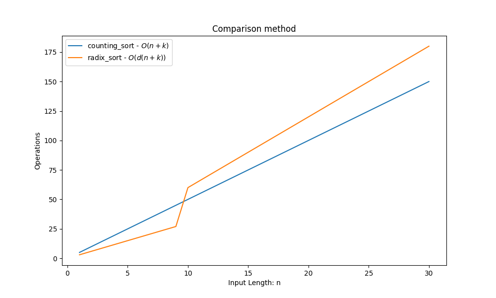

**LinearSorting Algorithm Complexity Analisys ( worst case )**
==============================================================

README writed by: [MARKPLATE](https://github.com/cecinuga/markplate)

**Counting Sort - $\ O(n+k)$**
------------------------------

**Radix Sort - $\ O(d( n+k ))$**
--------------------------------

Complexity Analysis
  

  
#### All sorting algorithms are in the Cormen notation

