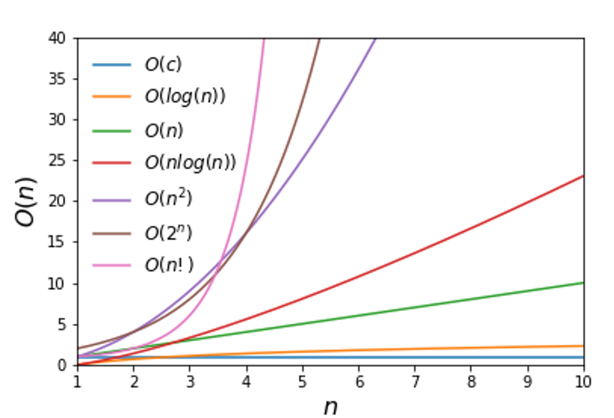

# What are you watching ?
This repo contain various algorithms, divided by category.
For each category you can analize a visual complexity representation

## What is Computational Complexity Theory?

Computational Complexity Theory is a branch of theoretical computer science that focuses on classifying computational problems according to their inherent difficulty. It aims to understand the resources required to solve these problems, such as time and space, and to determine the efficiency of algorithms.

### Key Concepts

- **Complexity Classes**: These are categories used to classify problems based on their computational complexity. Examples include P, NP, and NP-complete.
- **Big O Notation**: A mathematical notation used to describe the upper bound of an algorithm's running time or space requirements in terms of input size.
- **P vs NP Problem**: A major unsolved question in computer science that asks whether every problem whose solution can be quickly verified can also be solved quickly.

### Importance

Understanding computational complexity helps in designing efficient algorithms and in determining the feasibility of solving specific problems within reasonable resource limits.