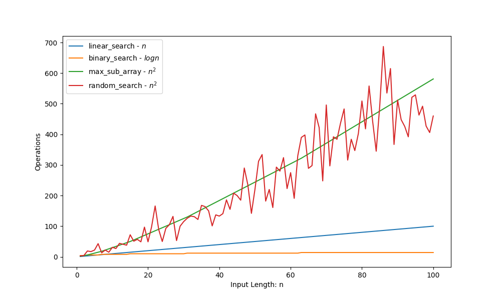

**Searching Algorithm Complexity Analisys ( worst case )**
==========================================================

README writed by: [MARKPLATE](https://github.com/cecinuga/markplate)

**Binary Search - $\ O(log n)$**
--------------------------------

**Linear Search - $\ O(n)$**
----------------------------

Complexity Analysis
  

  
#### All sorting algorithms are in the Cormen notation

